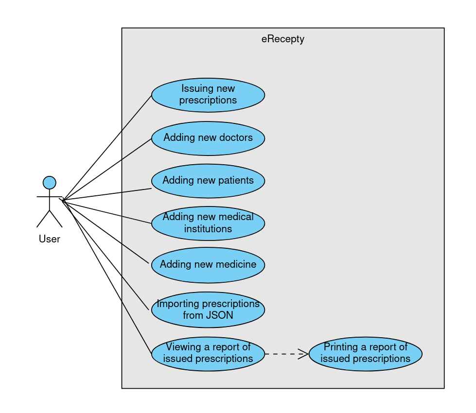
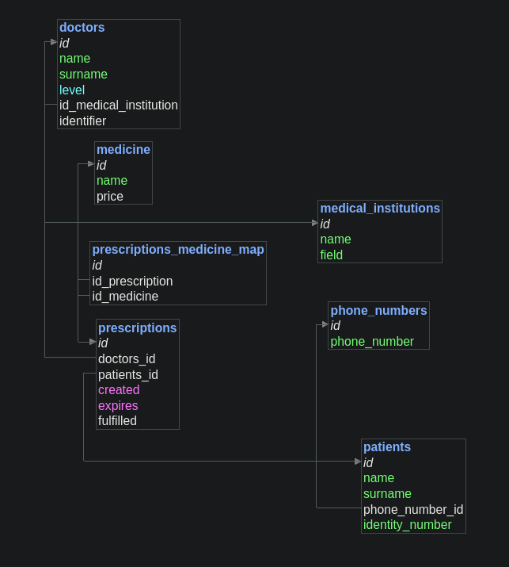

# eRecepty documentation
> A theoretical government application for issuing digital prescriptions.

This documentation includes detailed information about the application. For something more concise, read the [README](../README.md).

- author: **Ondřej Schlaichert**
- created between: **January 28th and February 3rd 2024**
- created as a school project for **SPŠE Ječná**

To protect my privacy, I have chosen to not include any contact details.

## Running the application
### Dependencies:
- **NodeJS v20.10.0** or compatible
- **MySQL 8.0.36** or compatible
### Steps:
For a step by step guide how to start and run the application, please refer to the [README](../README.md).
### Using the application:
The application will be hosted on the port specified in the .env file. While running, the server will listen on `http://localhost:<port>/`. It features an intuitive user interface; all operations are done by clicking on buttons and filling out forms.

The following use-case UML diagram demonstrates which actions are available:


## Configuring
All configuration is done with a `.env` file, which is located at the root of the project directory. It needs to be of the following format:
```
PORT=<server port>
SECRET_KEY=<secret key>

# Database connection
DB_HOST=<database host>
DB_USER=<database username>
DB_PASSWORD=<database password>
DB_NAME=<database name>
```
Only the database connection details are mandatory.

## Importing data
The application features functionality to import prescriptions with a JSON file. The file has to have the following format:
```
[
	{
		"doctorId": <id of the doctor>,
		"patientId": <id of the patient>,
		"expires": "<expiration date>",
		"medicine": [
			"<medicine 1>",
			"<medicine 2>",
			...
		]
	},
	...
]
```
For an example, refer to [this fixture](../fixtures/test-json.json).

## Database information
### ER diagram

### Used design patterns
Communication with the database is done using the [table gateway pattern](https://en.wikipedia.org/wiki/Table_data_gateway).

## Project summary and recollection
This project took me a few days and several hours to complete and I'm not quite sure I'm all too happy about that. Have I learnt anything? Not much, I think. I've applied knowledge I've previously obtained, most of it not at school mind you, and used up a lot of my time to do this instead of doing other, more productive tasks, like studying for maturita, working, or studying for university entrance exams.

As always, however, I tried to find things to learn. In particular, the following aspects of this project were new to me:
- MySQL. I've never worked with it before. Unsurprisingly, it works almost exactly as any other database.
- Getting JSON file contents with NodeJS and the Multer library. This was the most painful part of this project: I got stuck on this for like an hour because I'm stupid and can't read documentation properly, apparently.

...and that's about it.

The final project is nice, functional, although has no real world use, which is rather disappointing. It would be great if it was at least something *fun*, and not a government application. Oh well.